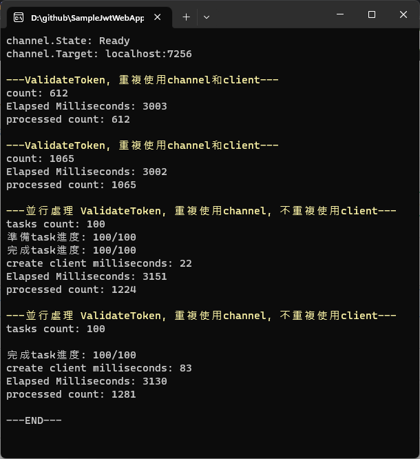

# SampleJwtWebApp

## 將 Jwt Token 轉發給 Auth Web Api驗證
透過TokenAuthenticationHandler, 並使用Grpc轉發
```
protected override async Task<AuthenticateResult> HandleAuthenticateAsync()
{
    if (!Request.Headers.ContainsKey("Authorization"))
    {
        return AuthenticateResult.Fail("Missing or invalid Authorization header.");
    }

    string token = Request.Headers["Authorization"].ToString();
    var reply = await _integrateAuthGrpcServiceClient.ValidateTokenAsync(new ValidateTokenRequest()
    {
        UserToken = token
    });
    if (!reply.Valid)
    {
        return AuthenticateResult.Fail("Token validation failed.");
    }

    List<Claim> claims = new();
    foreach (var claim in reply.Claims)
    {
        claims.Add(new Claim(claim.Key, claim.Value, claim.ValueType));
    }
    var identity = new ClaimsIdentity(claims, Scheme.Name);
    var principal = new ClaimsPrincipal(identity);
    var ticket = new AuthenticationTicket(principal, Scheme.Name);

    return AuthenticateResult.Success(ticket);
}
```
在Auth Web Api的Grpc Service的驗證
```
public override async Task<ValidateTokenReply> ValidateToken(ValidateTokenRequest request, ServerCallContext context)
{
    var userToken = request.UserToken;

    var httpContext = new DefaultHttpContext();
    httpContext.Request.Headers.Add("Authorization", userToken);
    httpContext.ServiceScopeFactory = _serviceScopeFactory;
    var authenticateResult = await httpContext.AuthenticateAsync(JwtBearerDefaults.AuthenticationScheme);

    var validateTokenReply = new ValidateTokenReply();
    if (authenticateResult.Succeeded)
    {
        var claims = authenticateResult.Principal.Claims;
        foreach (var claim in claims)
        {
            validateTokenReply.Claims.Add(new ValidateTokenClaimItem()
            {
                Key = claim.Type,
                Value = claim.Value,
                ValueType = claim.ValueType
            });
        }
        validateTokenReply.Valid = true;
    }
    else
    {
        validateTokenReply.Valid = false;
    }
    return validateTokenReply;
}
```

### validate token client call server 測試

